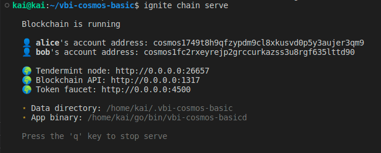

Goal: 
* Learners should understand how about Cosmos-sdk
* Learners should be setting up environment to learn

# Lesson 1: Overview Cosmos-sdk and setup environment

## What's Cosmos-sdk? 
Is a platform that helps users to build a blockchain (Cosmos ecosystem) easily and simply. Built with golang language, the Cosmos SDK is designed to help you build state machines. The SDK is a modular framework, which means that applications are built by assembling modules so that they interact with each other. Each module will contain its own message/transaction handler, and the SDK is responsible for routing each message to the module corresponding to that message., 

1. Main concepts:
* Account: Include three info: private key, public key, address 
* Transactions: Transactions are objects created by end-users to trigger state changes in applications. They are comprised of metadata that defines a context, and one or more sdk.Msg that trigger state changes within a module through the module's Protobuf message service.
* Messages: Messages are one of two primary objects handled by a module in the Cosmos SDK. The other primary object handled by modules is queries. While messages inform the state and have the potential to alter it, queries inspect the module state and are always read-only. In the Cosmos SDK, a transaction contains one or more messages. The module processes the messages after the transaction is included in a block by the consensus layer.
* Modules: Modules define most of the logic of Cosmos SDK applications.
* Protobuf: Protobuf is a data serialization method which developers use to describe message formats. There is a lot of internal communication within a Cosmos application, and Protobuf is central to how communication is done.
* Keepers: The core of the Cosmos SDK is a component called Keeper. It is the component that directly updates the state in the store
* Handler: Handler defines the action it will call the keeper to perform when it receives a certain Msg.

2. Importants modules:

* Auth - Authentication of accounts and transactions for Cosmos SDK applications.
* Authz - Authorization for accounts to perform actions on behalf of other accounts.
* Bank - Token transfer functionalities.
* Distribution - Fee distribution, and staking token provision distribution.
* Governance - On-chain proposals and voting.
* Mint - Creation of new units of staking token.
* Params - Globally available parameter store.
* Staking - setup validator and delegator

## Setup environment
1. Operating system: Linux/Mac
2. Golang: >=1.18
3. Ignite cli: Ignite CLI is an easy-to-use CLI tool for creating and maintaining sovereign application-specific blockchains. Blockchains created with Ignite CLI use Cosmos SDK and Tendermint
```bash
sudo curl https://get.ignite.com/cli | sudo bash
sudo mv ignite /usr/local/bin/
```
4. Make repo or Clone repo
```bash
ignite scaffold chain example | git clone https://github.com/kaito2001/learn-cosmos-sdk-vbi.git
``` 
5. Starting a chain
```bash
ignite chain serve
```


## Help video: 