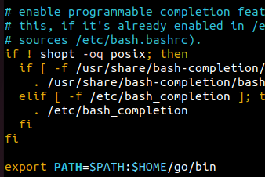
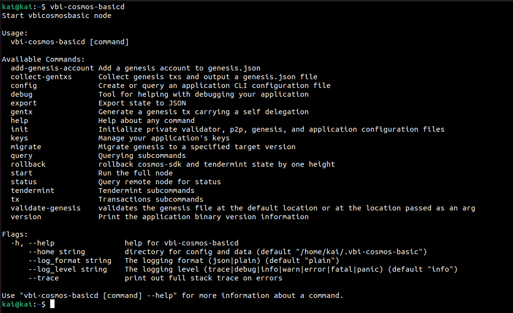
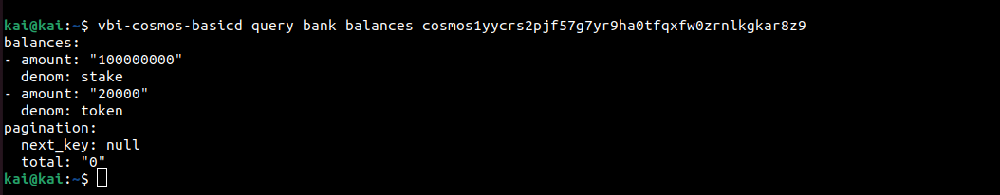
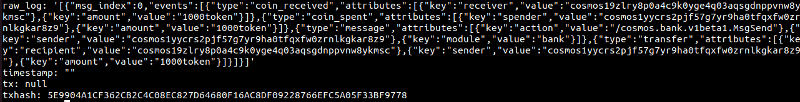

Goal: 
* Learners should understand how about interact local with chain
* Learners should be execution success transaction with address's balances.

# Lesson 2: Interact chain and make the first transaction   

## Interact local

* In the prev lesson, we installed the environment and launched a simulation chain, read at: https://github.com/kaito2001/learn-cosmos-sdk-vbi/blob/main/docs/chapter_1/lesson_1.md.

* For cosmos, a bin file will be generated with the format name_chain+'d'. Example: name chain's vbi-cosmos-basic -> bin file's vbi-cosmos-basicd. And we will handle and interact with the chain all like: key generation, transaction execution, config, launch, etc... (This bin file will be stored in the directory stored in the path when we setup golang, to check, we will search for the bin entry in golang)
bashrc


* In command line, type command:
```bash
vbi-cosmos-basicd
```
And GUI will show all option + flag



## Make first transaction

* To be able to make a transaction, we will have to have the address information of at least two accounts and one of those two addresses must have a balance. In the previous lesson, ignite did this job for us, after running the chain, it generated 2 accounts for us, respectively, bob and alice. Check information about address at: 
```bash
cd .vbi-cosmos-basic/keyring | cd .name_chain/keyring
```

* Show all address in store:
```bash
vbi-cosmos-basicd keys list show | name_chaind keys list show
```

* Check balances account:
```bash
vbi-cosmos-basicd q bank balances [address] [flag] | name_chaind q bank balances [address] [flag]
```

Now, we check balances with alice address:



* Transaction:

```bash
vbi-cosmos-basicd | name_chaind tx bank send [from_key_or_address] [to_address] [amount] [flags]
```

Now, we will send token from alice to bob address and verify action, it's show us log:


 
## Help video: 
