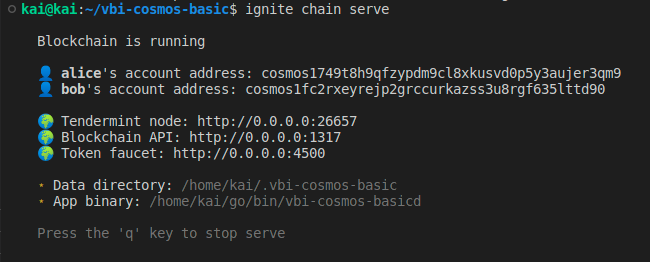

Goal: 
* Learners understand how to identify and configure node ports
* Learners understand how key stored.

# Lesson 3: Interacting chain with CLI and config port 

## Interacting chain with CLI 

In previos lesson, we did make transaction successful with commandline. In this lesson, we're continue interact chain, that's include create key, give balance to new account, choose how to store key and make transaction with this account.

Read previos lesson for starting chain and make first transaction at: https://github.com/kaito2001/learn-cosmos-sdk-vbi/blob/main/docs/chapter_1/lesson_2.md

1. Make new key
```bash
vbi-cosmos-basicd keys add <name> [flags]
```
Include: 
* name: name key
* Here, we're attention for two flag. --home (default "$HOME/.name_chain", maybe custom this and store this key pair at new dir, example i wanna stored in dir .ABC, vbi-cosmos-basicd keys add <name> --home '$HOME/.ABC'). --keyring-backend (suggest for use file option, should not use test)


2. Give balance to key

```bash
vbi-cosmos-basicd add-genesis-account [address_or_key_name] [coin] [flags]
```
* Here, an address is only active on the chain when it has a balance, [coin] - number balance + name token

* Check balance account
```bash
vbi-cosmos-basicd q bank balances [address] [flag]
```


* Account after add balances, in genesis file, it will be add:


* Now, we create more account with 'test1' name and send balance from test to test1:


* You should redo these steps with a store stored in the khsac directory.

## Config Port 

Now, we easy to see some port after we start run chain:



Config port's an essential thing in blockchain. For example, if the port you run coincides with other applications running in the background, it will surely report an error

A node has many ports to serve different purposes, but the three one worth focusing on are:
1. RPC (Remote Procedure Call) listen port (default 26657)
2. REST API listen port (default 1317)
3. P2P listen port (default 26656)

1. RPC
* change rpc address in config.toml
* vbi-cosmos-basicd start --rpc.laddr tcp://0.0.0.0:1800

2. REST API:
* enable REST API in app.toml
* enable swagger in app.toml
* change REST API in app.toml

3. P2P:
* change p2p address in config.toml
* vbi-cosmos-basicd start --p2p.laddr tcp://0.0.0.0:1900

## Help video: 

