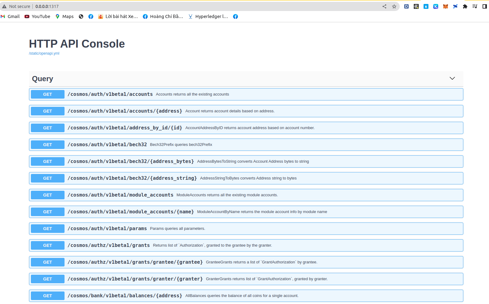
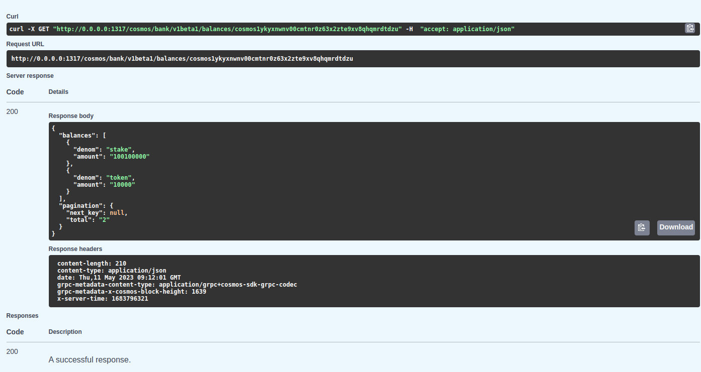
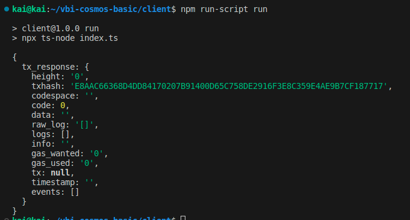

Goal: 
* Learners understand how to interacting chain with API
* Learners should be learn how to use Cosmjs to interacting chain

# Lesson 4: Interacting chain with API and make transactions with lib Cosmjs 

## Interacting chain with API Interface

In previos lesson, we did make interacting chain with cli and config change some important port. In this lesson, we're continue interacting chain but with API interface

Read previos lesson at: https://github.com/kaito2001/learn-cosmos-sdk-vbi/blob/main/docs/chapter_1/lesson_3.md

1. After start chain, it'll show some api in log and we'll do check with api (Blockchain API: http://0.0.0.0:1317 "default")



We should be query information account, balances account, information validator, delegator, vvv... 

2. And we'll check balances of an Account address



*Note: List this swagger for port 1317 just help u query still u want to check api for some action like: post, readmore at: https://github.com/cosmos/cosmos-sdk/tree/main/api/cosmos

## Make transactions with library Cosmjs

Cosmjs 's a library like web3js or etherjs (Ethereum), it's a lib connect frontend interface client with chain too. Now, we'll make an example to make transactions with this lib.

1. Create a folder name's client and make a file name package.json and parse this code:

```bash
{
  "name": "client",
  "version": "1.0.0",
  "description": "a quick package to demonstrate how to interact with node through API",
  "main": "index.js",
  "scripts": {
    "run": "npx ts-node index.ts"
  },
  "author": "kaito2001",
  "license": "ISC",
  "dependencies": {
    "@cosmjs/stargate": "^0.29.5",
    "axios": "^1.2.5",
    "dotenv": "^16.0.3",
    "ts-node": "^10.9.1"
  }
}
```

2. Run 'npm install' and make file name's 'index.ts' in client dir and parse this code: https://github.com/kaito2001/learn-cosmos-sdk-vbi/blob/main/client/index.ts . Important annotations for configuring port chain, transaction signing, transaction constructor and logging are all easily annotated there in.

3. Make file .env and config 2 param're: MNEMONIC(address forward token), TO_ADDRESS(address receive token)

4. Run 

```bash
npm run-script run
```

And it'll show log success tx:



## Help video: 