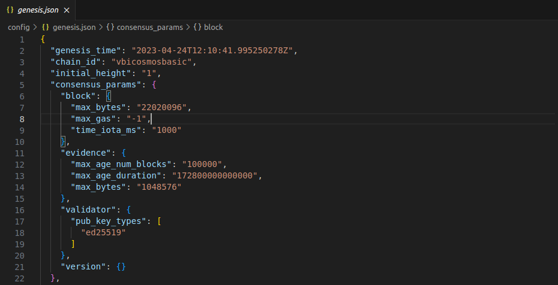
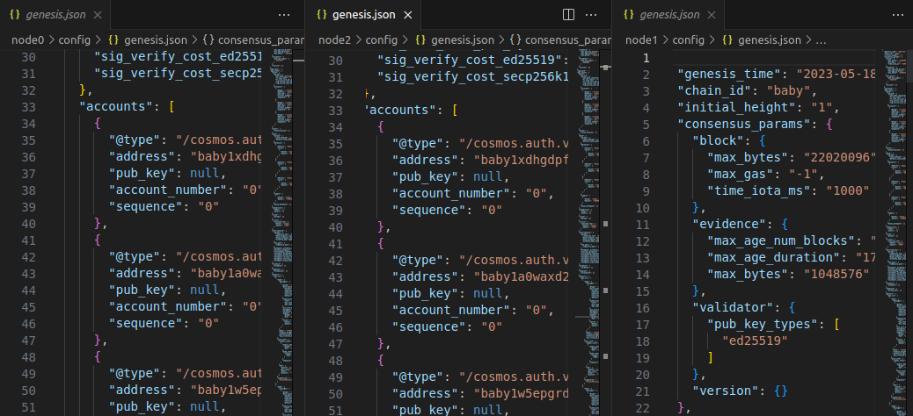

Goal:
* Learner should be understand what's genesis file. 
* Learner should be understand some field in genesis file (chain_id, height, bank)

In previous lesson, we did make interacting chain with API and use the cosmjs client lib to interact with chain with example sign and execute transactions.

Read previos lesson at: https://github.com/kaito2001/learn-cosmos-sdk-vbi/blob/main/docs/chapter_1/lesson_4.md

# Lesson 5: Genesis file - Part 1

## What's genesis file

genesis.json: a json file that defines the initial state of the chain (like a block zero). This file will contain necessary information related to network identification (chain_id), consensus params, and parameter configuration for keepers.

When we start chain, there'll be a directory that stores a lot of information about database chain, key-address created locally and genesis file include this dir. (Default name dir's .name_repo chain, example: name dir's: vbi -> dir store's: .vbi)



In case there're multiple storage nodes, each node'll store a genesis file and they will have sync with each other.



## Field in genesis file (genesis_time, chain_id, consesus_param)

In this lesson, we'll check three fields that is genesis_time, chain_id and consensus_param

1. genesis_time: a UTC timestamps which specifies when the blockchain is due to start. At this time, genesis validators are supposed to come online and start participating in the consensus process. The blockchain starts when more than 2/3rd of the genesis validators (weighted by voting power) are online.
```json
  "genesis_time": "2023-03-09T06:22:42.750266398Z",
```

2. chain_id: a unique identifier for your chain. It helps differentiate between different chains using the same version of the software.
```json
 "chain_id": "vbicosmosbasic",
```

3. consensus_param: defines consensus params for tendermint node. This will affect how Tendermint node behaves. In most case, this should be left alone.

```json
  "block": {
    "max_bytes": "22020096",
    "max_gas": "-1",
    "time_iota_ms": "1000"
  }
```
* There are three sub-params in field "block":
  * max_byte (max numbers of byte / block )
  * max_gas: total gas in a block cannot exceed this limit (if not setup, default is -1)
  * time_iota_ms: minimum time increment between consecutive blocks (in milliseconds).

```json
 "evidence": {
    "max_age_num_blocks": "100000",
    "max_age_duration": "172800000000000",
    "max_bytes": "1048576"
  }
```
* There are three sub-params in field "evidence":
  * max_age_num_blocks: defines the maximum number of blocks after which an evidence is not valid anymore. Ie. if its 1000, and we're at block 5000, only evidence since block 4000 will be considered valid
  * max_age_duration: Max age of evidence, in time. It should correspond with an app's "unbonding period" or other similar mechanism for handling [Nothing-At-Stake attacks]. Read more at (https://github.com/ethereum/wiki/wiki/Proof-of-Stake-FAQ#what-is-the-nothing-at-stake-problem-and-how-can-it-be-fixed)
  * max_bytes: This sets the maximum size of total evidence in bytes that can be committed in a single block and should fall comfortably under the max block bytes. Default is 1048576 or 1MB
  
```json
  "validator": {
    "pub_key_types": [
      "ed25519"
    ]
  }
```
* Validator public key configuration. Each node will have an unique validator public key. Try this command to see node public key

```bash
  vbicosmosbasicd tendermint show-validator
```

You maybe should change value height or chain_id in genesis file and restart chain.

## Help video: