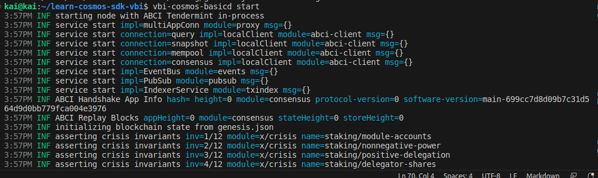

Goal:
* Learner should be created a basic chain for yourself

In previous lesson, We have learned what the genesis file is, what it does and some information about the data fields in it. 

Read previos lesson at: https://github.com/kaito2001/learn-cosmos-sdk-vbi/blob/main/docs/chapter_1/lesson_5.md

In this lesson, We'll create a basic chain for yourself not just with a command like "ignite chain serve" but through setup by step.

# Lesson 6: Make Basic Chain

## Setup binary file

In previous lessons, i mentioned about binary file in lesson 2 and it created then you run "ignite chain serve". Now, we'll make it by make file, create a file name 'Make file' and copy it: https://github.com/kaito2001/learn-cosmos-sdk-vbi/blob/main/Makefile.

* Note: If you created new chain, not clone this repo, you'll change some param in this shell relate to name_chain

Then, you'll run:
```bash
make install (for install some module required)
make build (for build binary app)
```
Check complete or not:


## Make a chain

Now, we've some flag you can know:

* add-genesis-account: add balances to account and add account to genesis.json
* gentx: generate a genesis tx carrying a self delegation
* collect-gentxs: collect all the genesis transactions with collect-gentxs to include it in your genesis file
* validate-genesis: validates the genesis file at the default location or at the location passed as an arg

1. You should be create a file shellscript for easy deployment with setup, we'll make file with name: scripts/setup-val-new-chain.sh 

2. Remove dir /.name_chain in $HOME

3. In scripts/setup-val-new-chain.sh:

* Init chain: 
```bash
name_chaind init $MONIKER --chain-id $CHAIN_ID
```

* Add some account:
```bash
name_chaind keys add $NAME_ACCOUNT
```

* Add genesis account:
```bash
name_chaind add-genesis-account $NAME_ACCOUNT $NUMBER_TOKEN
```

* gentx:
```bash
name_chaind gentx $NAME_ACCOUNT $NUMBER_TOKEN_STAKE --chain-id $CHAIN_ID
```

* collect-gentxs
```bash
name_chaind collect-gentxs
```

* validate-genesis
```bash
name_chaind validate-genesis
```

* start chain
```bash
name_chaind start
```

*Note: You must create accounts before adding balances to it.



## Help video: