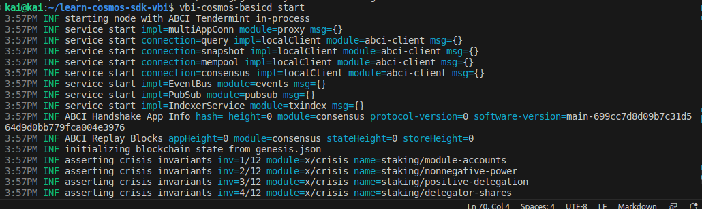
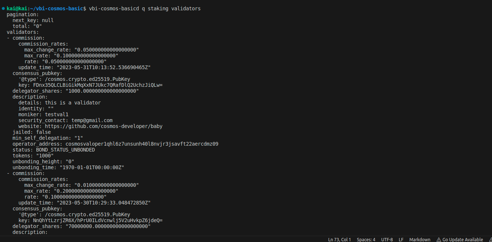

Goal:
* Learner should be understand about validator. 
* Learner should be create a validator for onchain (launched)

In previous lesson, we did make a basic chain with some step.

Read previos lesson at: https://github.com/kaito2001/learn-cosmos-sdk-vbi/blob/main/docs/chapter_1/lesson_6.md

# Lesson 7: Add Validator For Chain

In this lesson, we'll complete our chain by adding validator to our chain

## What's validator

A quick summary here about validator in the Cosmos network, it is similar to that in other blockchain networks, i.e. it participates as a block proposer (here adds a block of multiple transactions). In general, it will keep the network alive and of course it will have rewards for transactions in the block it proposes as well as rewards for traversing that block.

* Note:
There are 2 facts about validators that you should know:
1. Each node in the network can only register one validator
2. Node comes with the concept of validator, when people say that this network is secure or not, it usually depends on the number of validators or nodes more or less

## Setup a validator for chain

In previos lesson, we created a chain for ourselves in the previous lesson, and here we will continue to use the script run chain. 

```bash
cd scripts/
./start-basic-chain.sh
```

Result:


Then build chain successful, we'll continue create a validator for your chain(here, we have with a node and sure enough we will create only one validator):

1. Make new account:

```bash
vbi-cosmos-basicd keys add test3 --keyring-backend file
```

2. Add balances to this account:

```bash
vbi-cosmos-basicd tx bank send "account_have_balance" "address_account_test3" $numbertoken --keyring-backend file
```

3. Add validator for onchain:

```bash
vbi-cosmos-basicd tx staking create-validator --moniker "name_moniker"
--from test1
--amount="number_token_stake"
--pubkey="$(vbi-cosmos-basicd tendermint show-validator)"
--details="Test add validator"
--security-contact="example@gmail.com"
--website="https://github.com/kaito2001"
--commission-max-rate="0.10"
--commission-max-change-rate="0.05"
--commission-rate="0.05"
--min-self-delegation 1
--chain-id "name_chain_id"
--node tcp://0.0.0.0:number_port_rpc
-y
```

4. Query infor validator
   
```bash
vbi-cosmos-basicd q staking validators
```



Here, we've two validator, don't worry, remember in the previous post with the genx syntax, which is the syntax for creating a validator to initialize a string. And the validator we are creating is a validator for parties who want to register to be the network's validator after launch (stonk hehe).

## Help video:
