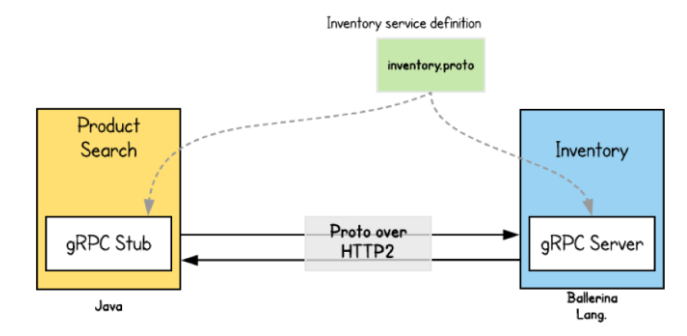
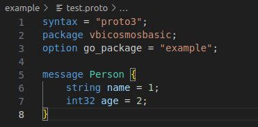

Goal: 
* Learners will understand what's gRPC model
* Learners should be create an example about Protobuf

# Lesson 1: gRPC Model

## What's gRPC model ?

Maybe, for young programmers who work at the Application layer like frontend, backend, they will work a lot with API models like REST, RESTful, Grapql... and gRPC is probably a fairly new term. Largely because the work they do doesn't need to involve gRPC to handle it.



gRPC's an RPC(Remote produce call) platform developed by Google to optimize and accelerate the communication between services in microservices architecture. gRPC also allows to define the structure of data in the form of a protoc file and it automatically generates a file used to communicate with the language you use. gRPC now also fully supports languages such as C++, Java, Python, Go, ... you can refer to it here https://grpc.io/docs/. gRPC uses Protocal Buffer to reduce the size of request and response data, RPC to simplify the communication between services, HTTP/2 to speed up sending/receiving HTTP requests

## Why does Cosmos use gRPC? And where to use it for processing?

Actually, Cosmos not only uses gRPC but it also uses REST, etc..., the reason is like the advantages I listed above, fast in data transmission, optimal performance (is what a blockchain network needs). The implementations for pushing data to validation via Validator and querying data from the database will be using gRPC. 

* Fact: 
1. As for sending data between peers, it will often use TCP in combination with a consensus algorithm to decide.

2. Data in the form of protobuf will be encoded into a byte array and then sent. And when query data from database, we decode that data and read it

## Example With Protobuf

As mentioned above, the gRPC model uses the protobuf data format, so here we will code an example of using protobuf (including encode and decode).

*Note: Begin start, you need install protobuf compiler name's protoc

In this repo, we make new dir name's example, and create file name's test.proto and parse it for your code.



* Include:
1. syntax: version protobuf
2. package: which helps to prevent naming conflicts between different projects
3. go_package: option defines the import path of the package which will contain all the generated code for this file. The Go package name will be the last path component of the import path
4. Message: format data 

And gen .proto -> .go:

```bash
protoc --go_out=. example/test.proto # "example/test.proto": Relative Path
```

Now, we'll see filename's: test.pb.go 

Create new dir name's proto-test and make new file's: execution. Parse it to your code https://github.com/kaito2001/learn-cosmos-sdk-vbi/blob/main/proto-test/execution.go

* Note: All explanations of working codes are clearly commented (encode, decode)

And after you run successfully: it'll show for u 


## Help Video: 


