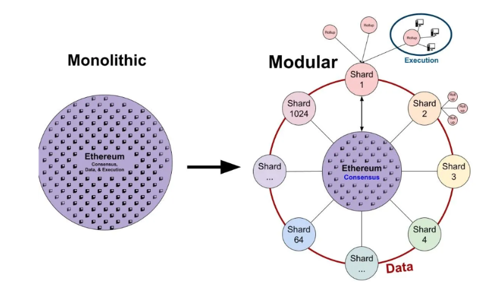
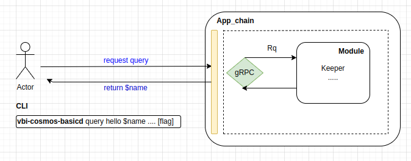
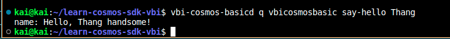

Goal: 
* Learners should be understand what's module in Cosmos sdk
* Learners's created a basic module 

# Lesson 2: Make First Module

In previos lesson, we have learned gRPC, in Cosmos how it is used as well as code an example of data format in gRPC which is protobuf. 

## What's a module in Cosmos ?

Not only in Cosmos but other platforms and frameworks from the frontend and backend all divide the code into packages and modules, not the code stuffed into a file. In a system or application, it is not possible to have only one function, dividing into small modules, each module handling a function will make the code easy to read, easy to develop and easy to maintain. 



Unlike the available L1 platforms Ethereum, Solana, etc... the development of logic in addition to creating transactions and storing it in the block (database) will usually be handled in Smartcontract. Cosmos has provided us with an architectural platform that can both build a solochain like other Layer1 blockchains, and can develop additional modules for customizing the processing logic to add to the chain (Of course, Cosmos still provides enough virtual machine modules to handle Smartcontract)

## Make Hello Module

Now, we'll make new module name's Hello :). It's great that when using ignite to build, you just need to type a few commands and then it will scaffold all for us, the rest is that I will think about it and write more logic as I like. Similar to modern frontend and backend frameworks today.



This is the architecture that we will implement, just create a query hello in CLI and it will respond back to you. Although simple, it will help you understand in Cosmos where to query the data it will get from Keeper(https://tutorials.cosmos.network/academy/2-cosmos-concepts/7-multistore-keepers.html).

* Fact:
1. The data in the new height blocks are queried from the database.
2. In the next post, we will create a module related to updating data, then we will intervene in the database.

Now, you'll follow these steps:

In repo chain,
```bash
ignite scaffold query say-hello name --response name
```

* include:
1. say-hello: name of function that handles logic in keeper and protobuf.
2. --response: endpoint output parameter display flag.

After u run this command, your code'll be change. 
```text
rpc SayHello (QuerySayHelloRequest) returns (QuerySayHelloResponse) {
    option (google.api.http).get = "/vbi-cosmos-basic/vbicosmosbasic/say_hello/{name}";
  
  }
```
Like you know, Cosmos use gRPC to query, create transactions. Now, we have the url with the endpoint parameter we just created, and it generated the code -> golang for us in the "types" package with two file: query.pb.go (i mention it in pre lesson) and query.pb.gw.go (translates gRPC into RESTful JSON APIs).

```text
return &types.QuerySayHelloResponse{Name: fmt.Sprintf("Hello, %s handsome!", req.Name)}, nil
```

In query_say_hello.go file at keeper package, change value function SayHello return to this.

Start chain, run: 
```bash
vbi-cosmos-basicd start
```

In query_say_hello.go file at client/cli package, we will see the code for using command to generate query from CLI.

And final, run:
```bash
vbi-cosmos-basicd query vbicosmosbasic say-hello Thang 
```

Result:


## Help Video: