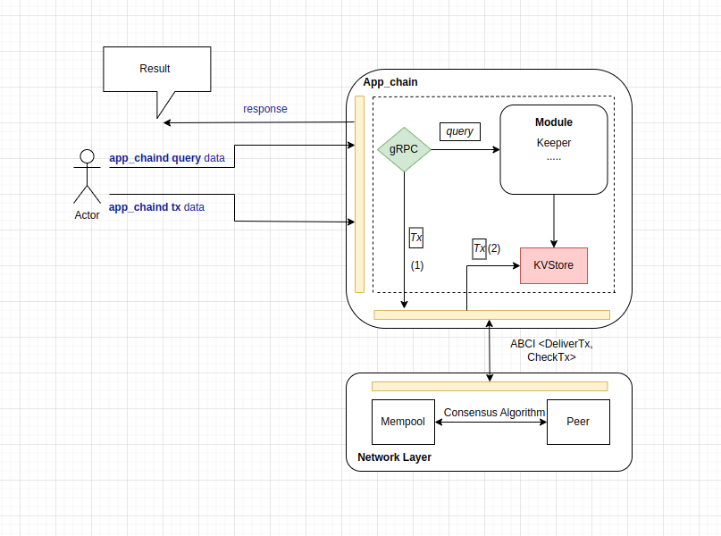
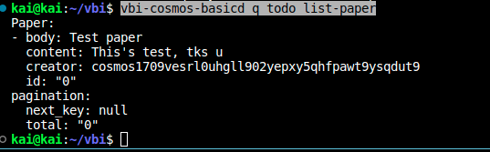

Goal: 
* Learners understand the flow of querying, data generation for the chain
* Learners know how to implement a module with functions to add, edit, and delete data for the chain

# Lesson 3: Make ToDo Module (CRUD data) 

In previos lesson, we created a basic module for query data in chain.

## How does querying, generating data work?



I've drawn about the operation flow running for querying and data generation (transaction) above, Here we will understand as follows:

1. For query: it will be queried from KVstore via Keeper in BaseApp. I explained this in the previous lesson.
 
2. For data creation: Because every time you create something, Cosmos requires you to sign it to prove that you are the creator of that thing. Then it will go through ABCI (checkTx, deliverTx functions) (1) will check and after verifying through Validators and consensus mechanism. It will be saved to Mempool and also via ABCI transferred to BaseApp and saved to KVstore (2).

## Make Todo Module 

Normally, for other layer1 chains, we will only be concerned with creating a transaction and querying it, roughly just issues related to token transfer, and creating external data will go through SmartContract. Like i said about architecture for layer1 chain, read more at: https://github.com/kaito2001/learn-cosmos-sdk/blob/main/docs/chapter_2/lesson_2.md. In Cosmos, the modularized architecture makes it flexible between creating modules and handling data such as adding, editing, deleting. That is, there will be a lot of problems that we can do depending on the complexity we draw. 

* Fact: In my opinion, the barrier between web2 and web3 is shortened through the things I listed above.

Now, we'll create module Todo follow some steps:

1. Create module name "todo" with Ignite:
```bash 
ignite scaffold module todo
```

2. Create object named paper with objects: body and content (field name's creator'll gen automation for sign data "default"). Add flag module + name_mod :))
```bash
ignite scaffold list paper body content --module todo 
```

3. Check all changes in your source:

* proto/todo: Define data to message
* x/todo/client: Handling deployment execution via command line
* x/todo/type: Contains functions that execute logic derived from proto -> golang
* x/todo/keeper: Processing center including repository and service navigate to KVstore

* Fact: You need read detail all to understand detail.

5. Restart chain
```bash
ignite chain serve --force-reset
```

4. Create a object paper with body and content as after (U should test with update and delete it):
```bash
vbi-cosmos-basicd tx todo create-paper "Test paper" "This's test, tks u" --from alice
```

5. Query it:
```bash
vbi-cosmos-basicd q todo list-paper
```

6. Result:
