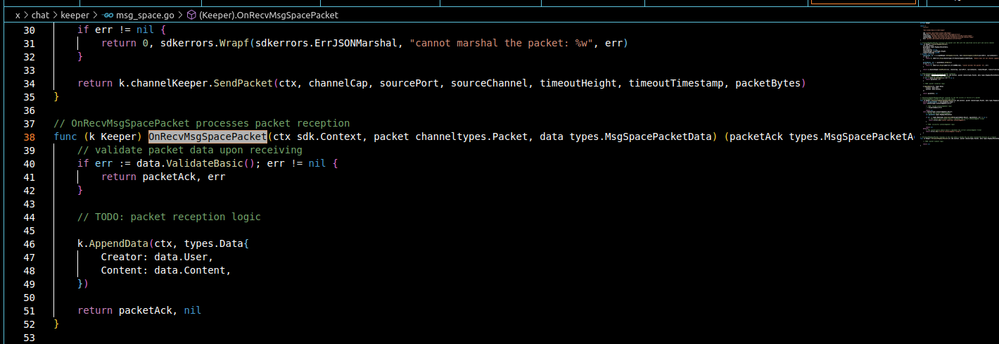

Goal: 
* Learner understands what's ibc and its application.
* Learner demo successfully sends data from chain A to chain B via IBC.

# Lesson 4: IBC Protocol

In the previous lesson, we created a module for CRUD data and understand how the workflow when querying or generating tx data. 

## What's IBC ?

In computer networks, we already know the layer model for the transmission of data between devices in the network. For users who directly use the device to access the internet, we are at the application layer using protocols such as http/https (access to the internet to read, and work with data), SMTP ( for email), DNS (for domain), etc... The architecture used at this layer is usually mainly client-server (too familiar with dev brothers), in addition, there are peer-to-peer, end-to-end.

IBC is a protocol developed in the Cosmos ecosystem for the transmission of data between blockchains in the Cosmos ecosystem. IBC is also considered a bridge and similar to other bridges, it operates at the application layer, the architecture used for data transmission according to the ibc homepage provide's end-to-end.

Here I have broken down how it works as the architecture I have drawn below:

                                       

1. Chain B creates a packet data sent to chain A via ibc protocol + address is registered as relayer.
2. Relayer submits packet to chain A and is transferred to mempool chain A, waiting to be processed by validator
3. Data is sent to baseapp via abci and stored in kvstore

## Feature 

 

The aim of ibc is given to be a secure, general-purpose bridging protocol serving all chains used from the cosmos-sdk platform. Similar to existing bridges on the market, data, tokens, state machine, smartcontract. IBC can do those things well and up to now, there have not been any successful hacking attacks related to this protocol.

* Fact: In the two chains that want to communicate, we can create multiple channels, each of which will handle one type of data to be transferred. 

## Demo

* Fact: I will demo on my one source chain by creating 2 chains running on it, so the ibc setup will only need on one source.

In this lesson, I'll demo IBC for send data from chain A to chain B (not token, not smartcontract, just data like: "Hello, is anyone there ?"), follow these steps:

1. Make module Chat integrated IBC:

```bash
vbi-cosmos-basicd scaffold module chat --ibc --ordering unordered 
```

2. Add CRUD data for module chat:
```bash
vbi-cosmos-basicd scaffold list chat content --module chat
```

3. Generate message for sending an IBC packet
```bash
ignite scaffold packet msgSpace user content --module chat
```

4. Add logic message to send and ack: 


* Logic send packet to relayer



* Logic ack packet from relayer

5. Write two scripts to run two chain:

```bash
cd scripts 
./start_chain_a.sh
./start_chain_b.sh
```

6. Setup relayer from npm:

```bash
npm i -g @confio/relayer
```

7. Config param two chain for relayer:
```bash
ibc-setup init 
```

and config file registry.yaml and app.yaml follow these:

```bash
registry.yaml

version: 1

chains:
  
  chat-1:
    chain_id: test
    prefix: cosmos
    gas_price: 0.0001stake
    ics20_port: 'test'
    rpc:
      - http://localhost:2281

  chat-2:
    chain_id: test
    prefix: cosmos
    gas_price: 0.0001stake
    ics20_port: 'test'
    rpc:
      - http://localhost:3281

\\\\\\\\\\\\\\\\\\

app.yaml
src: chat-1
dest: chat-2
mnemonic: opinion hip exile knock knee accuse chicken earth asthma minimum build office
srcConnection: connection-1
destConnection: connection-1

```

mnemonic: it's address'll come relayer to 2 chains for send and ack packet

* Note: remember add this mnemonic and add token for it in 2 chains

8. Create chanel 

```bash
ibc-setup chanel --help     \\\ You should be do it :)
```

9. Start query log:
```bash
ibc-relayer start
```

10. Send data from chain A to chain B:

```bash
vbi-cosmos-basicd tx chat send-msg-space test channel-0 "Dm sao khong chuyen duoc" an --keying-backend file --chain-id test --home "/home/kai/.chat1" --node "http://localhost:2281" --from an -y
```


11. Query data from Chain B:
```bash
vbi-cosmos-basicd q chat list-data --node "http://localhost:3281"
```


## Help Videos: